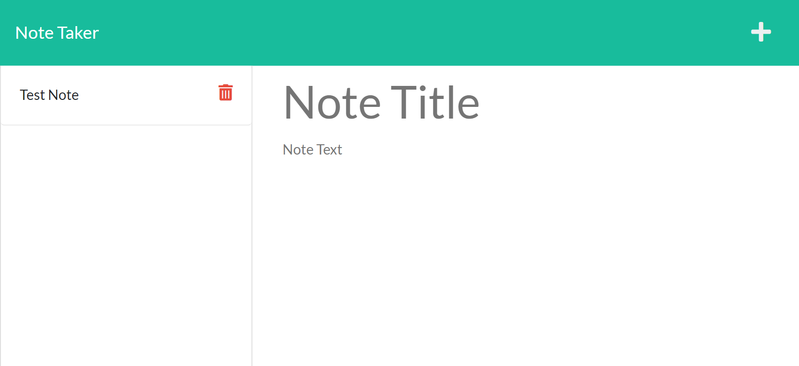

# Note Taker
   
  
  Check out the badges hosted by [shields.io](https://shields.io/).

  
  
  
  ## Description 
  
  This is an Express application that allows you to create, save, and delete notes.
  ## Table of Contents
  * [Installation](#installation)
  * [Usage](#usage)
  * [License](#license)
  * [Questions](#questions)
  
  ## Installation
  
  *Steps required to install project:*
  
  Clone the repository and open a terminal within the folder. Then use `npm i` to install the required dependencies. Or you can just use the app [here](https://rocky-wave-48631.herokuapp.com/).
  
  ## Usage 
  
  This application is deployed to Heroku here: https://rocky-wave-48631.herokuapp.com/

  Desktop Layout of the Application:
  
    
  ## License
 
  This project is under the MIT license.
  
  ---
  
  ## Questions?
  
  If you have any questions or would like to contribute, please contact me here:
 
  GitHub: [@jl118](https://api.github.com/users/jl118)
  
  Email: jen.liebelt@gmail.com
  